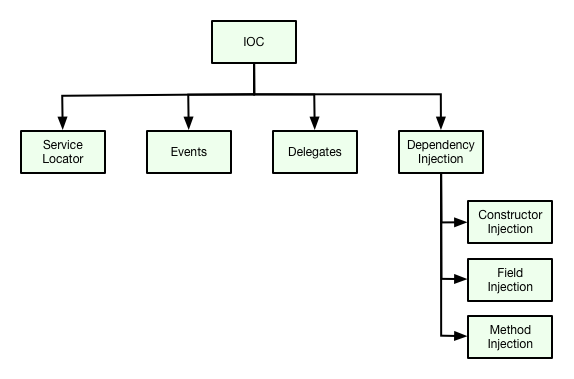

## Intruduction to IoC

The main goal of Inversion of control and Dependency Injection is to remove dependencies of an application. This makes the system more decoupled and maintainable.



Dependency injection is a concept valid for any programming language. The general concept behind dependency injection is called Inversion of Control. According to this concept a struct should not configure its dependencies statically but should be configured from the outside.

Dependency Injection design pattern allows us to remove the hard-coded dependencies and make our application loosely coupled, extendable and maintainable.

A Go struct has a dependency on another struct, if it uses an instance of this struct. We call this a struct dependency. For example, a struct which accesses a user controller has a dependency on user service struct.

Ideally Go struct should be as independent as possible from other Go struct. This increases the possibility of reusing these struct and to be able to test them independently from other struct.

The following example shows a struct which has no hard dependencies.

## Dependency Injection

One of the most significant feature of Hiboot is Dependency Injection. Hiboot implements JSR-330 standard.

Dependency Injection provides objects that an object needs. So rather than the dependencies construct themselves they are injected by some external means. For instance let’s say we have the following below struct `userService` who uses a `gorm.Repository` interface to query record from database. So rather than connect the database and creating an instance `gorm.Repository` from within the constructor, we can inject the same by importing  via a constructor as shown in the below code snippet.

```go

type userService struct {
    repository gorm.Repository
}

func newUserService(repository gorm.Repository) *userService {
    return &userService{
        repository: repository,
    }
}

```


### Constructor Injection

Although Field Injection is pretty convenient, but the Constructor Injection is the first-class citizen, we
usually advise people to use constructor injection as it has below advantages,

* It's testable, easy to implement unit test.
* Syntax validation, with syntax validation on most of the IDEs to avoid typo.
* No need to use a dedicated mechanism to ensure required properties are set.

```go


package main

import (
	"hidevops.io/hiboot/pkg/app/web"
	"hidevops.io/hiboot/pkg/model"
	"hidevops.io/hiboot/pkg/starter/jwt"
	"time"
)

// This example shows that jwtToken is injected through the constructor,
// once you imported "hidevops.io/hiboot/pkg/starter/jwt",
// jwtToken jwt.Token will be injectable.
func main() {
	// the web application entry
	web.NewApplication().Run()
}

// PATH: /login
type loginController struct {
	at.RestController

	token jwt.Token
}

type userRequest struct {
	// embedded field model.RequestBody mark that userRequest is request body
	model.RequestBody
	Username string `json:"username" validate:"required"`
	Password string `json:"password" validate:"required"`
}

func init() {
	// Register Rest Controller through constructor newLoginController
	app.Register(newLoginController)
}

// newLoginController inject jwtToken through the argument jwtToken jwt.Token on constructor
// the dependency jwtToken is auto configured in jwt starter, see https://hidevops.io/hiboot/pkg/starter/jwt
func newLoginController(token jwt.Token) *loginController {
	return &loginController{
		token: token,
	}
}

// Post /
// The first word of method is the http method POST, the rest is the context mapping
func (c *loginController) Post(request *userRequest) (response model.Response, err error) {
	jwtToken, _ := c.token.Generate(jwt.Map{
		"username": request.Username,
		"password": request.Password,
	}, 30, time.Minute)

	response = new(model.BaseResponse)
	response.SetData(jwtToken)

	return
}


```

### Field Injection

In Hiboot the injection into fields is triggered by **\`inject:""\`** struct tag. when inject tag is present
on a field, Hiboot tries to resolve the object to inject by the type of the field. If several implementations
of the same service interface are available, you have to disambiguate which implementation you want to be
injected. This can be done by naming the field to specific implementation.

```go
type userController struct {
	at.RestController

	BasicAuthenticationService AuthenticationService	`inject:""`
	Oauth2AuthenticationService AuthenticationService	`inject:""`
}

func newUserController() {
	return &userController{}
}

func init() {
	app.Register(newUserController)
}
```

### Method Injection

Method Injection one of the most significant features of Hiboot. Below is the source code of Hiboot starter jwt. `Middleware()` is depends on `Token`, Hiboot will inject the instance of `Token` through the argument of the method. For more details, please see [Hiboot starter](/auto-configure)

```go

// Package jwt provides the hiboot starter for injectable jwt dependency
package jwt

import (
	"github.com/dgrijalva/jwt-go"
	"hidevops.io/hiboot/pkg/app"
	mw "github.com/iris-contrib/middleware/jwt"
)

type configuration struct {
	app.Configuration

	Properties Properties `mapstructure:"jwt"`
	middleware *Middleware
	token      Token
}

func init() {
	app.Register(newConfiguration)
}

func newConfiguration() *configuration {
	return &configuration{}
}

// Middleware is the jwt handler
func (c *configuration) Middleware(jwtToken Token) *Middleware {
	return NewJwtMiddleware(mw.Config{
		ValidationKeyGetter: func(token *jwt.Token) (interface{}, error) {
			//log.Debug(token)
			return jwtToken.VerifyKey(), nil
		},
		// When set, the middleware verifies that tokens are signed with the specific signing algorithm
		// If the signing method is not constant the ValidationKeyGetter callback can be used to implement additional checks
		// Important to avoid security issues described here: https://auth0.com/blog/2015/03/31/critical-vulnerabilities-in-json-web-token-libraries/
		SigningMethod: jwt.SigningMethodRS256,
	})
}

// Token
func (c *configuration) Token() Token {
	t := new(jwtToken)
	t.Initialize(&c.Properties)
	return t
}

```